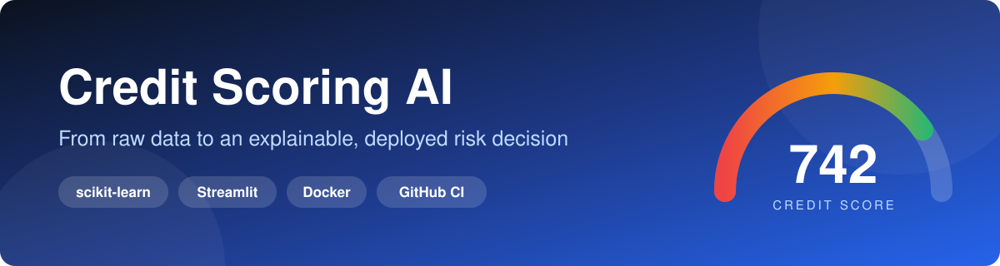
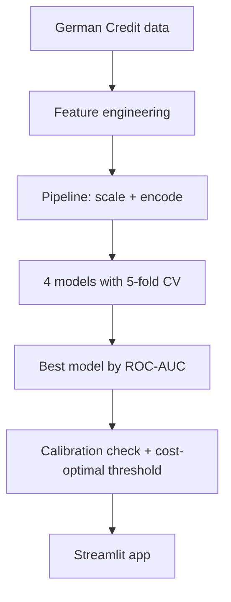
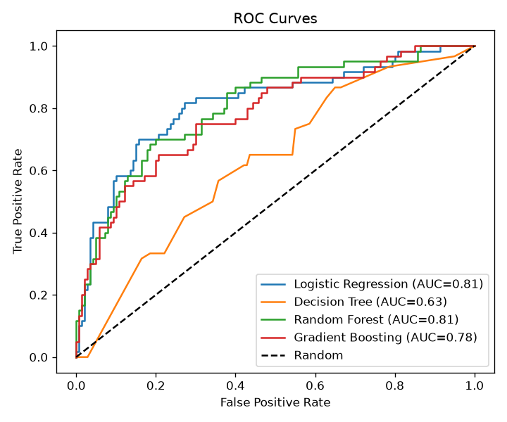
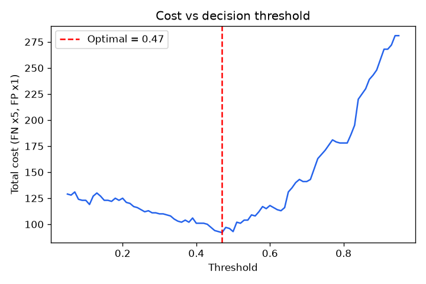
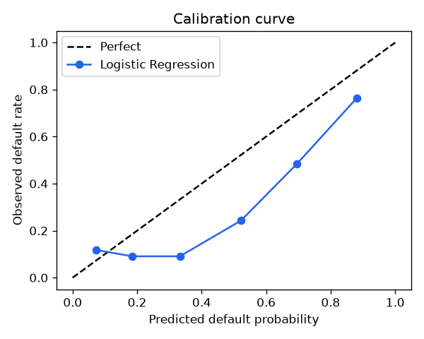
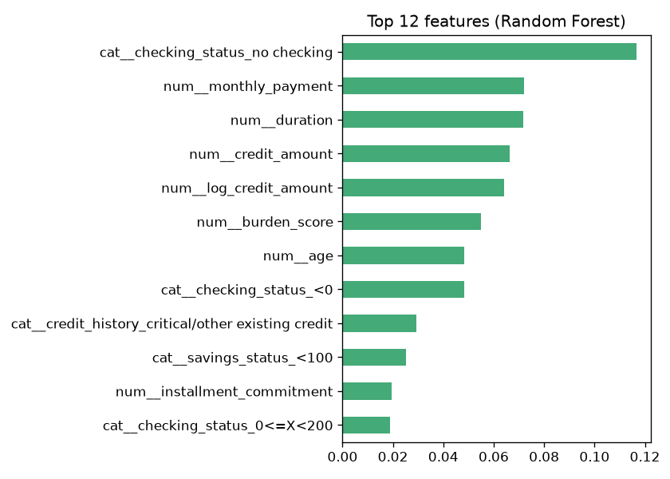

<div align="center">



<br/>

[](https://github.com/vanshitachoudhary/CodeAlpha_CreditScoring/actions)
[](https://codealphacreditscoring-vu7mcxteskbtj5x7apph82c.streamlit.app/)


### [🚀 &nbsp;Try the live demo](https://codealphacreditscoring-vu7mcxteskbtj5x7apph82c.streamlit.app/)

*CodeAlpha Machine Learning Internship · Task 1: Credit Scoring Model*

</div>

> **Heads up:** the free-tier demo sleeps when idle. If you see a "Wake up" button, click it and wait about 30 seconds. On a cold start the app trains the model automatically.

## 📑 Contents
[Problem](#-problem) · [At a glance](#-at-a-glance) · [What makes it different](#-what-makes-it-different) · [App](#-the-app) · [Methodology](#-methodology) · [Results](#-results) · [Run locally](#-run-locally) · [Structure](#-project-structure) · [Limitations](#-limitations-and-responsible-use) · [Roadmap](#-roadmap)

## 🎯 Problem
A bank must decide whether an applicant will repay a loan. This project predicts the **probability of default** from financial history, then turns it into something a loan officer can act on: a **credit score**, a **risk band**, and an **explanation of why**.

## 📈 At a glance

| 1,000 | 20 | 4 | 5-fold | 5 | 3 |
|:---:|:---:|:---:|:---:|:---:|:---:|
| applicants | raw features | models compared | cross-validation | engineered features | app views |

## 💡 What makes it different

Most credit-scoring demos stop at "accuracy = 78%". This one goes further:

| | |
|---|---|
| 🔒 **Leak-free pipeline** | Scaling and encoding live inside a scikit-learn `Pipeline`, so cross-validation never touches test data |
| ⚖️ **Imbalance-aware** | Only 30% of applicants default, so models use class weights and are judged on Recall, F1 and ROC-AUC, not accuracy alone |
| 📏 **Calibration check** | Brier score and a calibration curve test whether predicted probabilities can be trusted |
| 💰 **Business-cost threshold** | A missed defaulter costs 5x a wrongly rejected customer, so the decision threshold is optimised on cost instead of fixed at 0.5 |
| 🔍 **Explainable decisions** | Every prediction comes with a "why this result?" chart showing which factors raised or lowered the risk |
| 🧪 **Production habits** | Shared feature module, unit tests, GitHub Actions CI, Dockerfile, auto-train on first launch |

## 🖥️ The app

| View | What it does |
|---|---|
| **Single applicant** | Enter details and get a 300-850 score gauge, a decision (approve / extra verification / reject), the default probability and the top factors behind it |
| **Batch scoring** | Upload a CSV of applicants and download the scored results |
| **Model performance** | Metrics table, ROC curves, cost curve, calibration curve, feature importance and confusion matrix |

The risk threshold in the sidebar is adjustable and defaults to the cost-optimal value.

## 🔬 Methodology



**Dataset:** German Credit (UCI / OpenML `credit-g`). Target: default (1) vs good (0).

**Engineered features** (`features.py`, shared by training and the app so they can never drift apart): `monthly_payment`, `log_credit_amount`, `burden_score`, `long_duration`, `young_borrower`.

**Models:** Logistic Regression, Decision Tree, Random Forest, Gradient Boosting. The best model is chosen by ROC-AUC on a stratified 20% hold-out set.

## 📊 Results

Full metrics for all four models (Precision, Recall, F1, ROC-AUC, Brier score) are saved by `train.py` in
[`outputs/model_comparison.csv`](outputs/model_comparison.csv), which GitHub displays as a table. The positive class is **default**.

<table>
  <tr>
    <td align="center"><br/><sub>ROC curves</sub></td>
    <td align="center"><br/><sub>Cost vs decision threshold</sub></td>
  </tr>
  <tr>
    <td align="center"><br/><sub>Calibration curve</sub></td>
    <td align="center"><br/><sub>Feature importance</sub></td>
  </tr>
</table>

**Key takeaways**
- Tree-based and linear models perform similarly on this small dataset, so the simplest strong model is preferred for interpretability.
- The cost curve shows the optimal decision threshold sits close to 0.5 on this split, but the cost-based approach makes the trade-off explicit and adjustable.
- Checking account status and loan size are among the most influential features.

## 🚀 Run locally

```bash
git clone https://github.com/vanshitachoudhary/CodeAlpha_CreditScoring.git
cd CodeAlpha_CreditScoring
pip install -r requirements.txt

python train.py          # trains, evaluates, saves model and plots
streamlit run app.py     # opens http://localhost:8501
```

<details>
<summary><b>Run tests or Docker</b></summary>

```bash
pip install -r requirements-dev.txt
pytest
```

```bash
docker build -t credit-scoring .
docker run -p 8501:8501 credit-scoring
```
</details>

## 🗂️ Project structure

```
CodeAlpha_CreditScoring/
├── app.py                  # Streamlit app
├── train.py                # pipeline, model comparison, calibration, threshold
├── features.py             # shared feature engineering
├── tests/                  # unit tests
├── assets/                 # banner and screenshots
├── outputs/                # generated plots and metrics
├── data/                   # German Credit dataset
├── .github/workflows/      # CI: tests on every push
├── .streamlit/             # app theme
├── Dockerfile
└── requirements.txt
```

## ⚠️ Limitations and responsible use

- **Small dataset** (1,000 rows): metrics have high variance, so read them as indicative, not production-grade.
- **Calibration:** class weighting makes the model slightly over-estimate default risk (the calibration curve sits below the diagonal). A production system would recalibrate, for example with Platt scaling or isotonic regression.
- **Sensitive attributes:** the data includes age, personal status and foreign-worker status. A real lending system needs a fairness audit and legal review before using such features.
- **Illustrative score:** the 300-850 score is a linear rescaling of default probability, not a regulated scorecard.
- **Explanations** are what-if sensitivities, not Shapley values.

## 🛣️ Roadmap

- [ ] SHAP-based explanations
- [ ] Probability recalibration (Platt / isotonic)
- [ ] Hyper-parameter search with Optuna
- [ ] Fairness metrics by demographic group
- [ ] FastAPI serving layer

---

<div align="center">

**Vanshita Choudhary**

[GitHub](https://github.com/vanshitachoudhary) · [LinkedIn](https://www.linkedin.com/in/vanshita-choudhary-53840435b/) · [Live Demo](https://codealphacreditscoring-vu7mcxteskbtj5x7apph82c.streamlit.app/)

*If you found this useful, a ⭐ on the repo is appreciated.*

</div>
